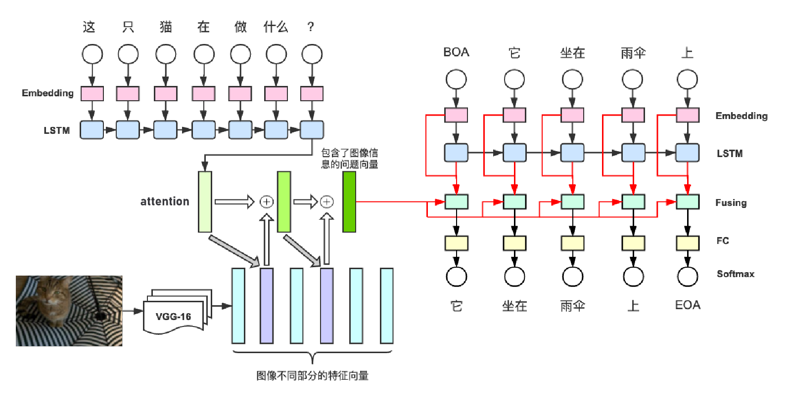
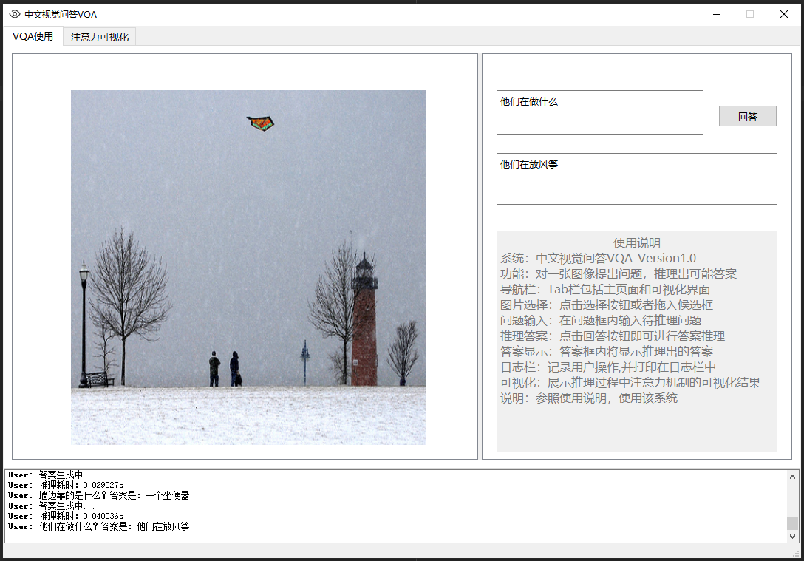
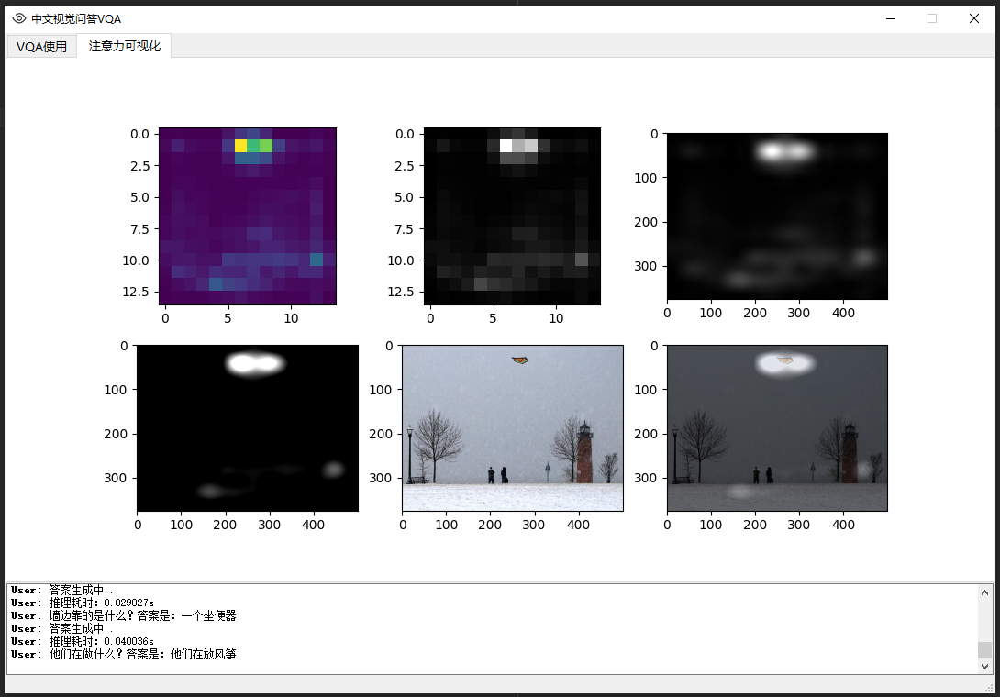

# VQA-Chinese-tf2
VQA-tf2

## Prerequisites 
- Python 3.7
- Tensorflow 2.0 or higher
- PyQt5
- jieba

## datasets
MS COCO2014、FM-IQA   
The training dataset is downloaded at: https://pan.baidu.com/s/1I9RANoJxq-G1h7nFF4WgOA 提取码：0k8v  
The weights  are downloaded at: https://pan.baidu.com/s/15O8vtS8bqY2NtXwGThAi0w 提取码：u97v

## Training
#### Prepare dataset(download training dataset,put coco2014 in the file named Data and FM-CH-QA in this folder)
`python extract_vgg_features.py   # Generate picture features` 
#### Train
`python train.py`
#### test example
`visual_model.ipynb`
#### run GUI
`python run.py`

## Network architecture

## GUI

